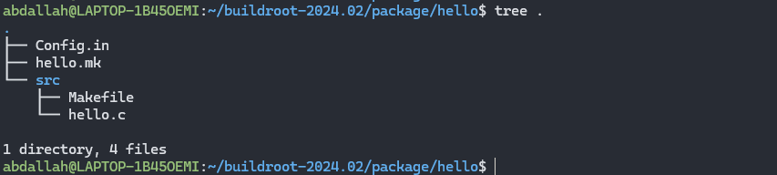
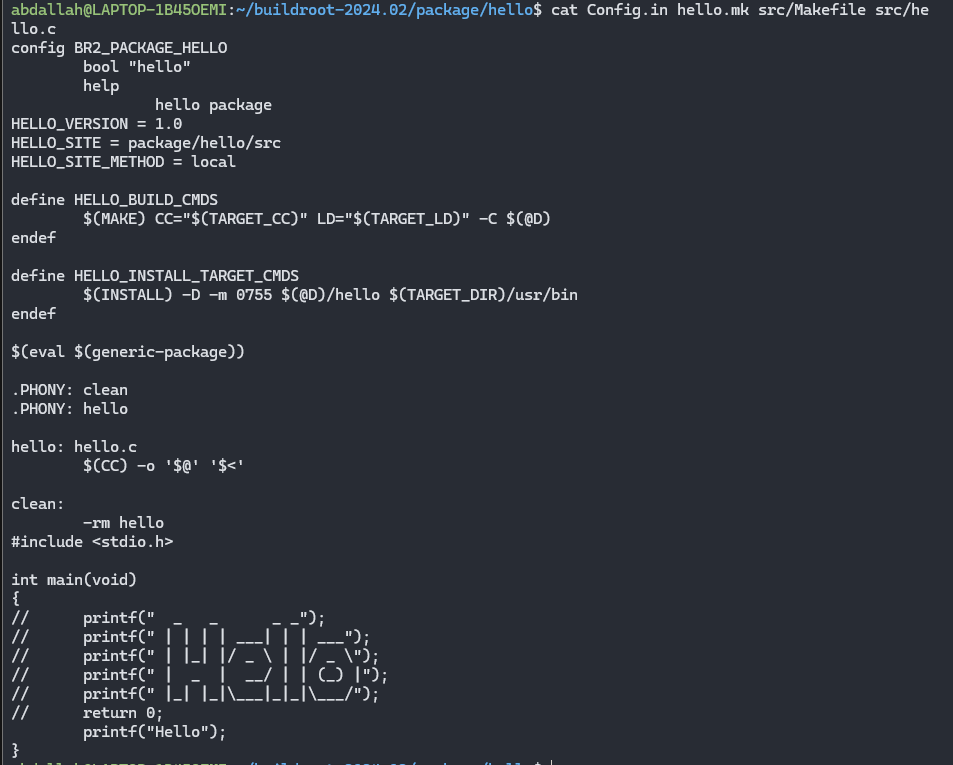

# The folder structure


# The folder Content



# To edit the code of the package

```bash
# Note that: The package name here is hello 
# 1.Edit the code 
# 2.
make hello-dirclean
# 3.
make hello
# 4. 
make
```