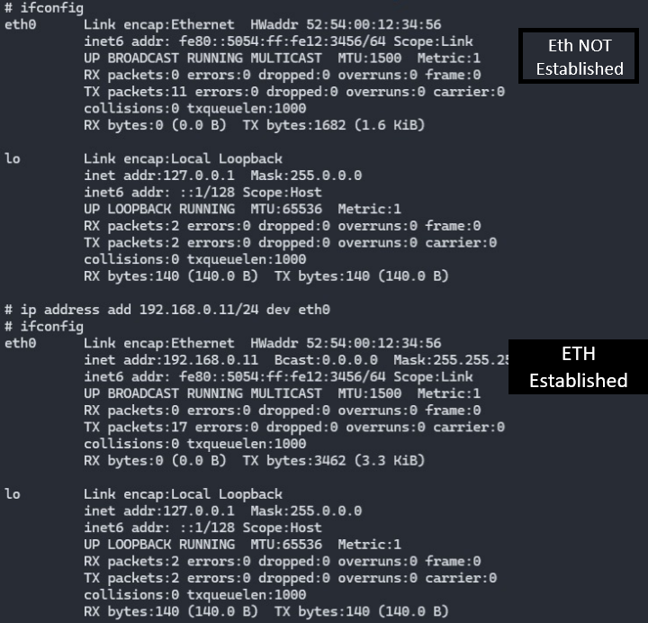

# How to Enable SSH between Qemu and My Host?


## Command
```bash
sudo qemu-system-arm -M versatilepb -kernel zImage -dtb versatile-pb.dtb -drive file=rootfs.ext2,if=scsi,format=raw -append "rootwait root=/dev/sda console=ttyAMA0,115200"  -net nic,model=rtl8139  -nographic -net tap,script=/home/abdallah/x-tools/qemu-ifup
```
## qemu-ifup
```bash
#!/bin/sh
ip a add 192.168.0.1/24 dev $1
ip link set $1 up
```
## Start the ip address and check it
```bash
ifconfig
ip address add 192.168.0.11/24 dev eth0
```


## Run the SSH


## Stop The SSH
```bash
exit
``` 

# *No need for systemd*